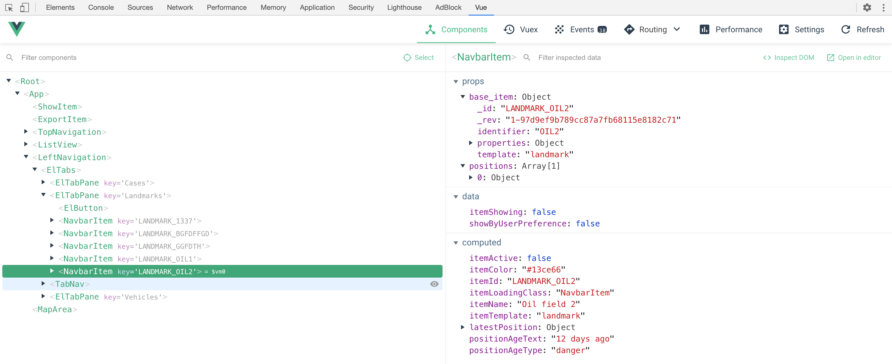

# Structure and internal Behaviour of the Vue app

We use the [Vue.js](https://vuejs.org/) framework for all the interactivity within our app.

## Folder structure

- The entry point is in `src/main.ts`, where most imports happen and the Vue instance is set up.
- The `src/utils/` folder contains abstraction layers and utility functions for communicating with the database (`dbWrapper.ts` and `pouchWrapper.ts`), setting up and interacting with the map display (`mapWrapper.ts`) and for accessing local storage within the browser sandbox (`storageWrapper.ts`)
- The topmost Vue component is `src/App.vue`, which imports and references many of the other components.
- Most visible page sections can be found in the `src/components/` folder, such as `MapArea.vue`, `TopNavigation.vue` and `LeftNavigation.vue`.
- Some item-specific components are in the folder `src/components/items/`, including `CreateItem.vue` and `ShowItem.vue`. Here, you will also see `NavbarItem.vue`, which is referenced from `src/components/LeftNavigation.vue` to render multiple interactive navigation bar entries on the left side of the OneFleet app.
- As onefleet does not hard-code vehicle types but uses template for creating and displaying items instead, you can (currently) find the case/vehicle template definitions in `src/components/items/templates.ts`. This file may be moved soon, though.

## Vue component hierarchy



The OneFleet app currently consists of nested vue components, which is (currently still) standard Vue procedure.

**Here's a quick summary of how Vue works:**
A component can receive data from their parent component via the "props" vue functionality, and store their own independent data as defined in a component's "data" section. If you want to perform an action whenever a prop or data field chenges, you can use Vue's "watch" section to do that. Additional fields can be computed on the fly when needed, using the "computed" section. This has the additional benefit that computed data is cached and only ever recomputed when the data or prop(s) that the computation depends on, changes. Then, there is the "methods" section containing any methods that you may need either while rendering a component's HTML template or as part of any other method or _computed_ field. Finally, a Vue component has a "mounted" and a "created" section, which can execute code either already when the component is first created (≈instantiated) or later during mounting (≈rendering).

The best way to get to know all the different existing components in the OneFleet app is probably to just read the code and inspect the running app through the browser's debug window and the Vue DevTools plugin for Chromium or Firefox.

## Database communication

As mentioned in README.md, we use a CouchDB instance (or PouchDB during local development) as our persistent storage backend (for loading and storing map items and their positions) and automatic synchronisation of changes between client devices. The app maintains a connection to a remote DB instance, which is set up to be automatically kept in sync with a local mirror of that same data within the local user's browser (using the browser's built-in IndexedDB for emulating a PouchDB within the browser's sandbox).

However, as Vue offers us the benefit of observing data changes and feeding them to any (sub-)components via props, we currently use a single point of (as of now one-way) communication with the browser's IndexedDB/PouchDB instance. Within `src/App.vue` there is a section where the `dbWrapper` is given a handler that updates the Vue-controlled data fields. Hence, any change in the DB will automatically also update all all components that use this data, either directly in `App.vue` or in any sub-component that recieves the data via _props_.

```javascript
this.$db.setOnChange('items', 'base_items_change', () => {
  this.loadItems();
});
this.$db.setOnChange('positions', 'base_positions_change', () => {
  this.loadPositions();
});
```

Currently, all data movement from the database into Vue should be covered by this central handler. However, some components still write directly to the dbWrapper when storing data. See e.g. `ShowItem.vue` and `CreateItem.vue` for examples. This may also be made more compatible with Vue guidelines in the future.

## Map setup and interaction

We currently use Leaflet for displaying a map, and use the `mapWrapper` for communicating with it so that all other code can be agnostic of the specific mapping implementation that we use. You may notice that the template part of `MapArea.vue` is quite empty, consisting only of a single _div_ with a id="mapArea". This id will be filled in by Leaflet as soon as it is initialised within the `mapWrapper`. This component largely just passes on any event from any part of the app to the mapWrapper.

```HTML
<template>
  <div id="mapArea"></div>
</template>
```
